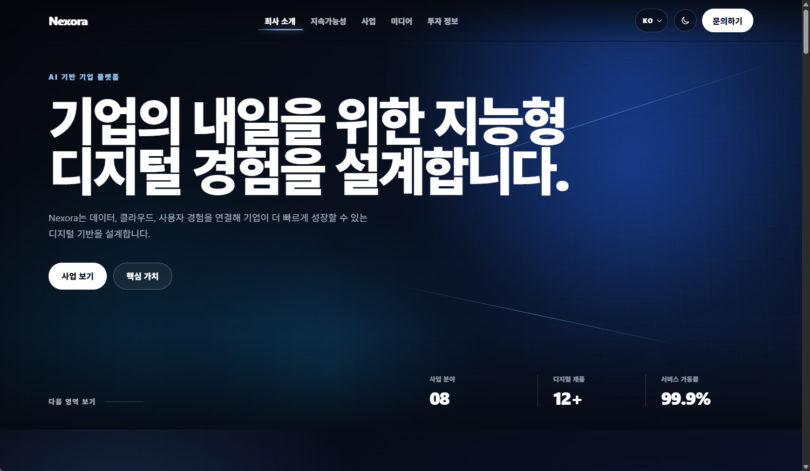
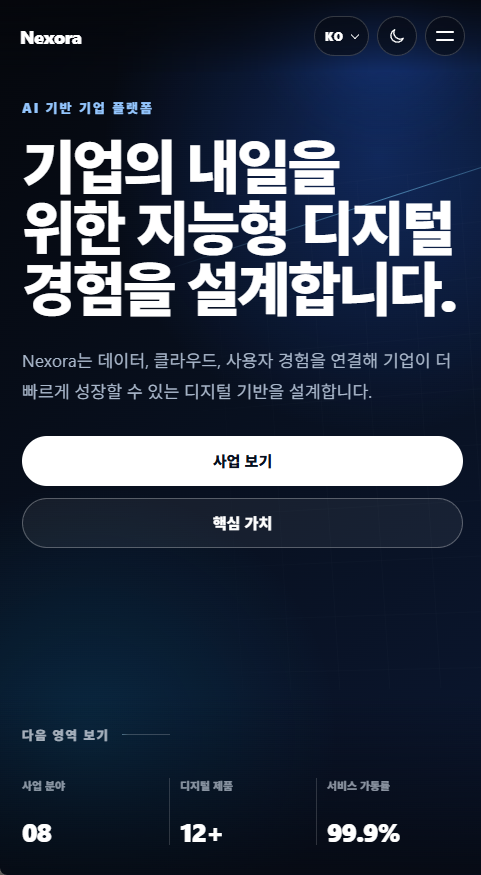

# Nexora Corporate Web

React와 TypeScript로 구현한 기업형 반응형 웹사이트입니다.

Nexora라는 가상의 디지털 서비스 기업을 주제로, 실제 기업 홈페이지에서 사용하는 정보 구조와 화면 흐름을 직접 설계했습니다. 특정 기업의 문구, 로고, 이미지 또는 소스 코드를 복제하지 않았으며 프로젝트에 포함된 콘텐츠와 UI는 모두 별도로 작성했습니다.

## 프로젝트 소개

Nexora Corporate Web은 회사 소개, 지속가능성, 기술 파트너, 비즈니스 포트폴리오, 미디어, 투자 정보, 푸터까지 하나의 흐름으로 구성한 프론트엔드 프로젝트입니다.

정적인 화면 재현에 그치지 않고 다음과 같은 실제 서비스 개발 요소를 함께 적용했습니다.

- 재사용 가능한 React 컴포넌트 구조
- 데이터 기반 콘텐츠 렌더링
- 데스크톱·태블릿·모바일 반응형 레이아웃
- 한국어·영어·일본어 다국어 지원
- 라이트·다크 테마 전환 및 설정 저장
- 스크롤 위치에 따른 내비게이션 상태 관리
- 섹션 진입 모션과 그래프 애니메이션
- 키보드 탐색과 모션 감소 설정 대응

## 주요 화면 구성

### 회사 소개

대형 타이포그래피와 배경 그래픽을 활용해 서비스 방향과 핵심 지표를 전달합니다. 화면 이동에 따라 플로팅 헤더의 크기와 활성 메뉴가 변경됩니다.

### 지속가능성

기술적 책임, 운영 효율, 장기적인 확장성을 카드 형태로 구성했습니다. 데스크톱과 모바일에서 서로 다른 레이아웃으로 자연스럽게 전환됩니다.

### 기술 파트너

클라우드, 인프라, 데이터베이스, 개발 플랫폼을 두 개의 슬라이더로 구성했습니다. 모바일에서는 선택한 기술 분야를 중심으로 주변 항목이 펼쳐지는 허브형 탐색 UI를 적용했습니다.

### 비즈니스 포트폴리오

여덟 개 사업 영역을 데이터 기반으로 렌더링하고, 선택한 항목에 따라 우측 상세 카드의 제목과 설명이 변경됩니다.

### 미디어

보도자료와 개발 과정 콘텐츠를 서로 다른 카드 구조로 구성했습니다. 대표 콘텐츠와 보조 콘텐츠의 시각적 위계를 분리해 정보 탐색이 쉽도록 설계했습니다.

### 투자 정보

주가 정보, 재무 보고서, IR 자료를 전환할 수 있는 탭과 SVG 기반 애니메이션 차트를 구현했습니다. 모바일에서는 탭, 그래프, 선택 항목 설명 순서로 재배치해 탐색 동선을 줄였습니다.

### 푸터

주요 메뉴, 정책 링크, 관련 사이트, 회사 정보를 한 영역에 정리했습니다. 실제 세계 지도 데이터를 기반으로 도시 간 연결 경로와 이동 입자 모션을 적용했습니다.

## 사용 기술

- React
- TypeScript
- Vite
- CSS
- React Icons
- i18next
- Git
- GitHub

## 주요 기능

- 데스크톱·태블릿·모바일 반응형 레이아웃
- 플로팅 헤더 및 현재 섹션 활성 상태 표시
- 모바일 내비게이션 메뉴
- 라이트·다크 테마 전환
- 시스템 테마 감지 및 사용자 설정 저장
- 초기 렌더링 시 테마 깜빡임 방지
- 한국어·영어·일본어 다국어 지원
- 히어로 배경 애니메이션 및 핵심 지표
- 스크롤 진행 상태 표시
- 섹션 진입 모션
- 데이터 기반 비즈니스 포트폴리오
- 기술 파트너 슬라이더 및 모바일 허브 UI
- 보도자료 및 SNS 미디어 콘텐츠
- SVG 기반 투자 지표 차트
- 실제 세계 지도 기반 푸터 네트워크 모션
- 키보드 탐색 및 접근성 속성
- `prefers-reduced-motion` 대응

## 프로젝트 구조

```text
nexora-corporate-web/
├─ README.md
├─ docs/
│  ├─ assets/
│  │  └─ nexora-preview.gif
│  └─ deployment.md
└─ web/
   ├─ public/
   ├─ src/
   │  ├─ assets/
   │  ├─ components/
   │  ├─ data/
   │  ├─ hooks/
   │  ├─ i18n/
   │  ├─ lib/
   │  ├─ styles/
   │  ├─ App.tsx
   │  ├─ App.css
   │  ├─ index.css
   │  └─ main.tsx
   ├─ index.html
   ├─ package.json
   └─ vite.config.ts
```

## 로컬 실행

저장소를 내려받은 뒤 `web` 디렉터리에서 의존성을 설치하고 개발 서버를 실행합니다.

```bash
cd web
npm install
npm run dev
```

터미널에 표시되는 로컬 주소로 접속해 화면을 확인할 수 있습니다.

## 프로덕션 빌드

```bash
cd web
npm run build
```

빌드 결과는 `web/dist` 디렉터리에 생성됩니다.

## 빌드 결과 미리보기

```bash
cd web
npm run preview
```

프로덕션 빌드 결과를 로컬 환경에서 확인할 때 사용합니다.

## 배포

배포 설정과 확인 항목은 아래 문서에 정리되어 있습니다.

```text
docs/deployment.md
```

기본 배포 설정은 다음과 같습니다.

```text
Base directory: web
Build command: npm run build
Publish directory: dist
```

## 작업 목적

기업형 웹사이트의 콘텐츠 구조와 화면 흐름을 직접 설계하고, 이를 유지보수하기 쉬운 React 구조로 구현하는 것을 목표로 진행했습니다.

컴포넌트 분리, 구조화된 데이터 관리, 다국어 지원, 반응형 스타일, 사용자 설정 저장, 접근성 속성, 애니메이션, 프로덕션 빌드 검증까지 실제 프론트엔드 개발 과정에서 필요한 작업을 단계별로 반영했습니다.

## 화면 미리보기

### 데스크톱

기업형 레이아웃과 주요 섹션 구성을 데스크톱 화면에서 확인할 수 있습니다.



### 모바일

모바일 내비게이션, 반응형 콘텐츠 배치, 기술 파트너 허브와 투자 정보 화면을 확인할 수 있습니다.

